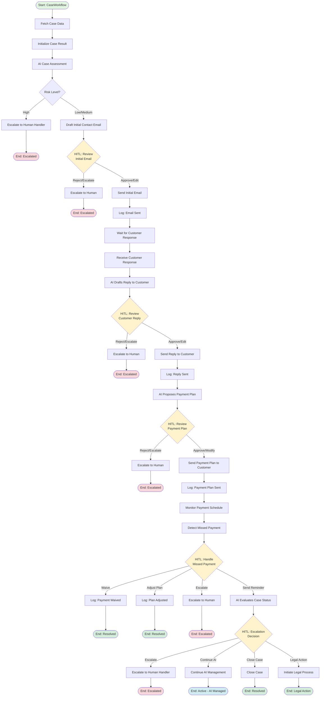

# Case Workflow - AI-Driven Debt Collection

## Overview

This workflow demonstrates an AI-driven debt collection process with human-in-the-loop (HITL) controls at every customer communication point. The workflow ensures compliance, maintains human oversight, and provides a full audit trail of all actions.

## Workflow Activity Diagram



## Key Components

### Input Parameters
- **caseId**: Unique identifier for the debt collection case

### Human-in-the-Loop (HITL) Decision Points

1. **Initial Contact Email Review**
   - Actions: `approve`, `edit-and-approve`, `reject`, `escalate`
   - Purpose: Review AI-generated first contact email

2. **Customer Reply Response Review**
   - Actions: `approve`, `edit-and-approve`, `reject`, `escalate`
   - Context: Includes customer's original message
   - Purpose: Review AI response to customer inquiry

3. **Payment Plan Proposal Review**
   - Actions: `approve`, `modify`, `reject`, `escalate`
   - Purpose: Review AI-proposed payment terms (6-month plan)

4. **Missed Payment Action**
   - Actions: `send-reminder`, `adjust-plan`, `escalate`, `waive`
   - Purpose: Decide how to handle missed payment

5. **Escalation Decision**
   - Actions: `escalate`, `continue-ai`, `close-case`, `legal-action`
   - Purpose: Final decision on case handling strategy

### Escalation Triggers

The workflow automatically escalates to a human case handler when:
- Initial risk assessment is **High**
- Human rejects or requests escalation at any HITL point
- Multiple intervention attempts fail

### Case Result

The workflow returns a `CaseResult` object containing:
- Case and customer identifiers
- Outstanding amount
- Start and completion timestamps
- Final status
- Payment plan acceptance flag
- Complete activity log (audit trail)

## Possible Final States

| Status | Description |
|--------|-------------|
| **Escalated to Human** | Case requires human case handler intervention |
| **Active - AI Managed** | Case continues under AI management |
| **Resolved** | Payment plan executed successfully or case closed |

## Workflow Characteristics

- **AI-First**: AI orchestrates the entire process
- **Human-Controlled**: Humans approve all customer communications
- **Auditable**: Full activity log maintained
- **Compliant**: Multiple approval gates ensure compliance
- **Flexible**: Multiple exit paths based on case complexity

## Example Usage

```csharp
// Start workflow with just a case ID
var result = await workflow.RunAsync("CASE-2024-001");

// Result contains full history
Console.WriteLine($"Status: {result.Status}");
Console.WriteLine($"Payment Plan Accepted: {result.PaymentPlanAccepted}");
foreach (var log in result.ActivityLog)
{
    Console.WriteLine(log);
}
```

## Integration Points

- **Case Data Fetch**: Simulates retrieval from external database/CRM
- **Email Sending**: Would integrate with email service
- **Payment Processing**: Would integrate with Settle/Zeta or similar platforms
- **Task Management**: Uses Xians agent task system for HITL approvals

---

**Related Documentation**: See `ai_debt_collection_human_in_loop.md` for domain context and business requirements.
