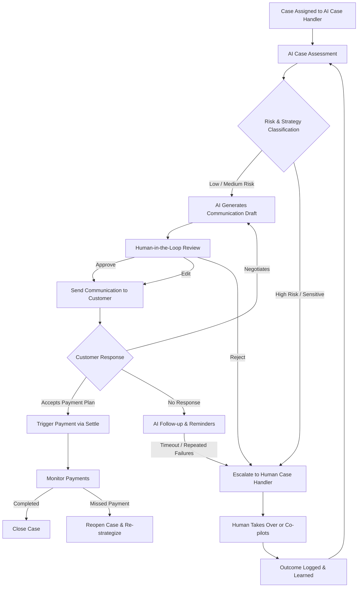

# AI-Driven Debt Collection Workflow (Human-in-the-Loop)

This document describes an **AI Case Handler** workflow where AI agents manage the full debt collection lifecycle, while humans remain in control of sensitive decisions and customer communications.

---

## Key Principles

- **AI-first orchestration**: One AI Case Handler owns the case lifecycle
- **Human-in-the-loop (HITL)** for customer-facing communication and sensitive decisions
- **Per-case workflow initiation**
- **Tight integration with payment platforms (e.g., Settle/Zeta)**
- **Auditable, governed, explainable decisions**

---

## High-Level Flow

---

## Detailed Workflow (Step-by-Step)

### 1. Case Handover
- Human assigns a case to the **AI Case Handler**
- AI becomes the system-of-record owner for the case

### 2. AI Case Assessment
AI evaluates:
- Outstanding amount
- Payment history
- Customer behavior
- Legal/compliance constraints
- Recommended strategy

### 3. Strategy Classification
- Low risk → automated, AI-led
- Medium risk → AI-led with frequent HITL
- High risk → early human involvement

### 4. AI-Generated Actions
AI can:
- Draft emails / SMS / portal messages
- Propose payment plans
- Schedule reminders
- Predict likelihood of recovery

### 5. Human-in-the-Loop Controls
For **all customer communication**:
- Human can **approve**, **edit**, or **reject**
- Feedback is fed back into AI learning
- Full audit trail maintained

### 6. Payment Orchestration (Settle / Zeta)
When customer agrees:
- AI triggers payment flow
- Supports:
  - One-off payments
  - Installments
  - Deferred payments
- AI monitors payment status

### 7. Continuous Monitoring
AI continuously:
- Tracks payment adherence
- Adjusts strategy
- Re-engages customer if needed

### 8. Escalation Logic
Escalation occurs when:
- Customer disputes
- Repeated failures
- Legal or compliance thresholds reached

### 9. Learning Loop
- Human decisions improve AI models
- Strategy effectiveness tracked per case
- System improves over time

---

## Why This Model Works

- Scales like automation
- Feels human to customers
- Keeps compliance teams comfortable

---

## Optional Extensions

- Voice AI agents (with approval gates)
- Predictive legal escalation
- Multi-agent collaboration (Negotiator, Risk Analyst, Payment Agent)

---

**Author:** Generated with ChatGPT  
