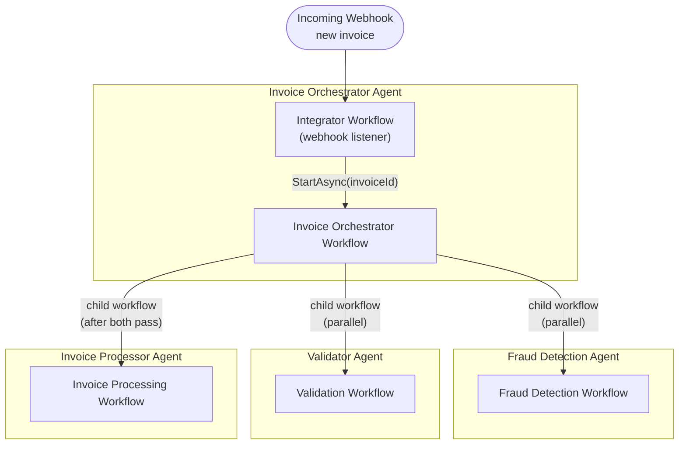
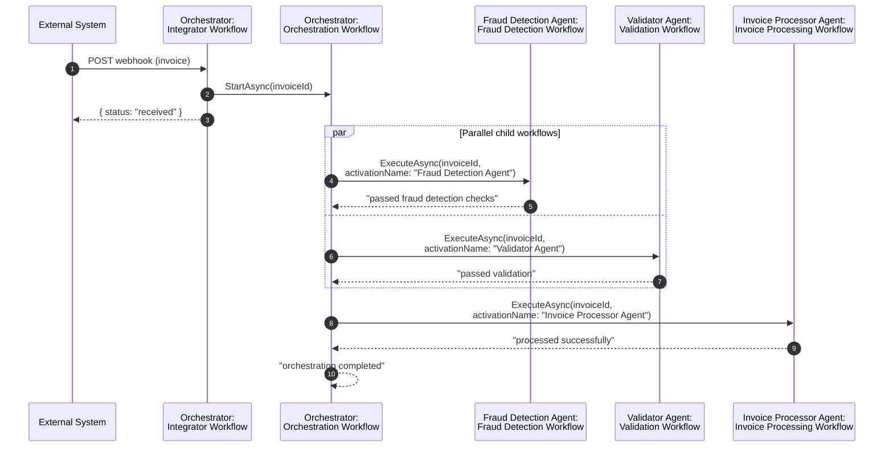

# Multi-Agent Orchestration Sample

This sample demonstrates how to build a **multi-agent system** on the Xians platform, where one agent orchestrates workflows that belong to *other* agents. The scenario is an invoice processing pipeline composed of four independent agents:

| Agent | Workflow | Responsibility |
|---|---|---|
| **Invoice Orchestrator Agent** | `InvoiceOrchastratorWorkflow` | Receives invoices via webhook and coordinates the end-to-end flow |
| **Fraud Detection Agent** | `FraudDetectionWorkflow` | Analyzes an invoice for signs of fraud |
| **Validator Agent** | `ValidatorWorkflow` | Validates the data and structure of an invoice |
| **Invoice Processor Agent** | `InvoiceProcessorWorkflow` | Carries out the actual invoice processing |

All four agents are registered and run from a single process (`Program.cs`), but each is a **separately registered agent** on the platform with its own workflows and its own activation. The orchestrator calls into the other agents' workflows across agent boundaries.

## Architecture



## How the flow works

1. **Webhook intake** — The orchestrator agent defines an *integrator workflow* that listens for webhooks. When an invoice webhook arrives, the handler extracts the invoice ID and fires off the orchestration workflow, then immediately responds to the caller:

```csharp
integratorWorkflow.OnWebhook((context) =>
{
    var invoiceId = "dummy-invoice-id"; // get from context.Webhook.Payload

    XiansContext.Workflows.StartAsync<InvoiceOrchastratorWorkflow>([invoiceId]);

    context.Respond(new { status = "received", webhook = context.Webhook.Name });
});
```

2. **Parallel checks** — The orchestration workflow runs fraud detection and validation **in parallel** as child workflows. Because these workflows belong to *different agents*, each call is targeted at an **activation** of the owning agent via `activationName`:

```csharp
var fraudDetectionTask = ExecuteChildAsync<FraudDetectionWorkflow>(
    "Fraud Detection Agent", invoiceId);
var validationTask = ExecuteChildAsync<ValidatorWorkflow>(
    "Validator Agent", invoiceId);

// Workflow-safe alternative to Task.WhenAll (keeps the workflow deterministic)
var results = await Workflow.WhenAllAsync(fraudDetectionTask, validationTask);
```

3. **Processing** — Once both checks complete, the orchestrator invokes the Invoice Processor Agent's workflow the same way, then returns the final result.

### Sequence of inter-agent workflow calls



## Key concepts demonstrated

### Calling another agent's workflow

Cross-agent calls go through `XiansContext.Workflows.ExecuteAsync`, passing the **activation name** of the target agent so the platform routes the child workflow to the right agent activation:

```csharp
return await XiansContext.Workflows
    .ExecuteAsync<TWorkflow, string>(
        [invoiceId], uniqueKey: invoiceId, activationName: activationName);
```

- `uniqueKey` (the invoice ID) keeps child workflow IDs distinct across concurrent orchestrations of different invoices.
- `activationName` targets the activation of the agent that owns the workflow. If the activation doesn't exist or has been deactivated, the platform throws `ActivationNotFoundException` or `ActivationDeactivatedException`, which the sample catches and logs (see `ExecuteChildAsync` in `InvoiceOrchastratorWorkflow.cs`).

### Non-activable workflows

All the domain workflows are registered with `Activable = false`, meaning they can't be started directly by users — they only run when invoked by another workflow (the webhook handler or the orchestrator):

```csharp
agent.Workflows.DefineCustom<InvoiceOrchastratorWorkflow>(new WorkflowOptions { Activable = false });
```

### Deterministic parallelism

Inside a workflow, `Workflow.WhenAllAsync` is used instead of `Task.WhenAll` to await the parallel child workflows while keeping the workflow deterministic and replay-safe.

### One process, many agents

`Program.cs` registers all four agents against the platform and runs their workers concurrently:

```csharp
var invoiceOrchastratorAgent = InvoiceOrchastratorAgent.Setup(xiansPlatform);
var fraudDetectionAgent = FraudDetectionAgent.Setup(xiansPlatform);
var validatorAgent = ValidatorAgent.Setup(xiansPlatform);
var invoiceProcessorAgent = InvoiceProcessorAgent.Setup(xiansPlatform);

await Task.WhenAll(
    invoiceOrchastratorAgent.RunAllAsync(),
    fraudDetectionAgent.RunAllAsync(),
    validatorAgent.RunAllAsync(),
    invoiceProcessorAgent.RunAllAsync()
);
```

In production these agents could just as easily live in separate processes or services — the inter-agent calls work the same way because they are routed through the platform, not through in-process references.

## Project structure

```
MultiAgentOrchastration/
├── Program.cs                          # Platform init + registers and runs all four agents
├── InvoiceOrchastrator/
│   ├── InvoiceOrchastratorAgent.cs     # Agent registration, webhook integrator workflow
│   └── InvoiceOrchastratorWorkflow.cs  # Orchestration logic (calls the other agents)
├── FraudDetection/
│   ├── FraudDetectionAgent.cs          # Agent registration
│   └── FraudDetectionWorkflow.cs       # Fraud check (placeholder logic)
├── Validator/
│   ├── ValidatorAgent.cs               # Agent registration
│   └── ValidatorWorkflow.cs            # Invoice validation (placeholder logic)
└── InvoiceProcessor/
    ├── InvoiceProcessorAgent.cs        # Agent registration
    └── InvoiceProcessorWorkflow.cs     # Invoice processing (placeholder logic)
```

## Running the sample

1. Create a `.env` file in this folder with your platform connection details:

```env
XIANS_SERVER_URL=<your Xians server URL>
XIANS_API_KEY=<your Xians API key>
```

2. Run the project:

```bash
dotnet run
```

3. All four agents register with the platform and start listening. Trigger the flow by sending the invoice webhook to the Invoice Orchestrator Agent's integrator workflow (via the Xians platform). The console will log the webhook receipt, followed by the orchestration, fraud detection, validation, and processing steps.

> **Note:** each of the four agents must have an active **activation** in your tenant, since the orchestrator targets the other agents by activation name (`"Fraud Detection Agent"`, `"Validator Agent"`, `"Invoice Processor Agent"`). If an activation is missing or deactivated, the orchestrator logs a warning and receives `null` for that step's result.
